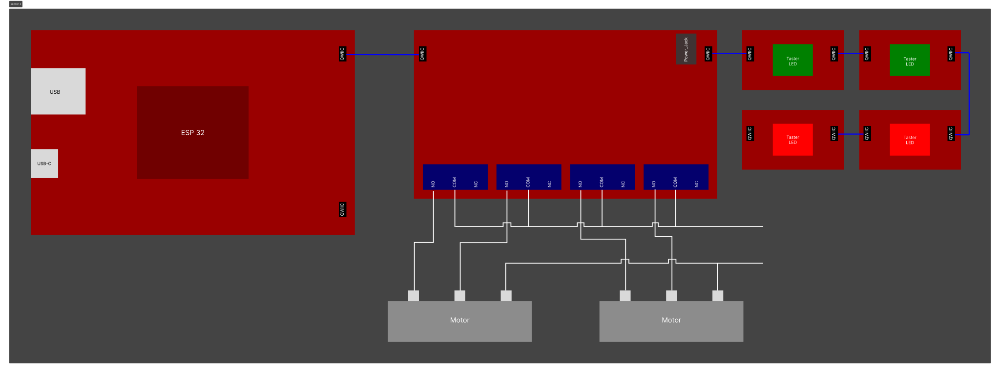

# Betriebshandbuch

## Infrastruktur

### Umgebung

Die Motoren sollten über einen Endschalter verfügen. Zusätzlich können Jalousien mit eigener Steuerungsanlage nicht immer verwendet werden. In der Theorie können auch Jalousien mit Steuerungsdrähten verwendet werden, solange diese eingeschaltet bleiben müssen um in eine Richtung zu fahren.

### Hardware

Es wurde ein ESP32 mit Arduino Framework verwendet. Die Software sollte auch mit anderen I2C fähigen Mikrocontrollern funktionieren die das Arduino Framework unterstützen. Zusätzlich kann nur der Quad Relay von SparkFun mit dem Standardcode verwendet werden (Stand 28.04.26).

## Installation

### Installieren

Meist gibt es bei einem Jalousienmotor 2/3 Phasen und einen Neutralleiter. Die jeweiligen Phasen müssen so an einen Quad Relay angeschlossen werden:

- **Motor 1:**
  - 1NO = Up
  - 2NO = Down
  - 1COM & 2COM = N

- **Motor 2:**
  - 3NO = Up
  - 4NO = Down
  - 3COM & 4COM = N

Wenn der Motor 3 Phasen hat, kann meist zwischen ganz runter und gekippt gewählt werden, man kann die Prä
renz dann mit einem der Down verbinden.

### Konfigurieren

#### Config-API

**URI**

PATCH /config

**Header**

|  Name   |  Typ   | Required |                Beschreibung                 |
| :-----: | :----: | :------: | :-----------------------------------------: |
| api_key | string |   yes    | Der API-Key der im Secrets definiert wurde. |

**Parameters (JSON)**

|    Name    | Typ | Required |                                                                   Beschreibung                                                                   |
| :--------: | :-: | :------: | :----------------------------------------------------------------------------------------------------------------------------------------------: |
| switchTime | int |    no    | Die Zeit die die Relais warten bis sie schalten. Muss zwischen 500 - 5000 sein. Ohne delay kann es zu beschädigung von motor oder Relays kommen. |
| maxRuntime | int |    no    |                     Die Zeit die die Jalousien fahren soll. Muss zwischen 0 und 180000 sein. Aktualisiert die `standardTime`                     |

**Beispiel**

PATCH /config

Headers:
api_key: ASJFLOENNLD1245AFSDk

Body:
{
"switchTime": 1000,
"maxRuntime": 60000
}

## Betrieb

### Bedienung

#### Buttons

Beim kurzen Drücken (< 300 ms) der Buttons wird die Jalousie nur kurz angesteuert (300 ms) und danach wieder gestoppt.

Beim Langen Drücken (> 300 ms) geht der Motor vollständig nach oben bzw. unten. Bei erneutem Drücken wird der Motor gestoppt.

Beim Drücken der anderen Seite wird die aktive Seite gestoppt und die gedrückte Seite nach der switchTime gestartet.

#### Motor API

**URI**

GET /motor?id=\<id>&cmd=\<command>&time=\<ms>

**Parameters**

| Name |  Typ   | Required |                                                      Beschreibung                                                       |
| :--: | :----: | :------: | :---------------------------------------------------------------------------------------------------------------------: |
|  id  |  int   |   yes    |                                 Motor ID. Kontrolliert welcher Motor angesteuert wird.                                  |
| cmd  | string |   yes    |                                    Auszuführender Befehl: `up`, `down`, oder `stop`.                                    |
| time |  int   |    no    | Runtime in Millisekunden. Motor stoppt automatisch nach dieser Zeit. Wenn nicht verwendet, wird `standardTime` genutzt. |

**Beispiel:**

/motor?id=2&cmd=stop&time=2000

### Aktualisierung der Software

Die Aktualisierung der Software kann durch einen erneuten Upload mit PlatformIO durchgeführt werden. Die neueste Version der Software ist auf dem [Github Repository](https://github.com/gbssg/ims.project.shuttercontrol) verfügbar.

### Troubleshooting

Wenn die Ausgabe über USB keine richtigen Rückgaben zurückkommen, überprüfe ob der Prozessor die Baudrate (115200) unterstützt und die Baudrate in platformio.ini und des Prozessors richtig gesetzt ist.
