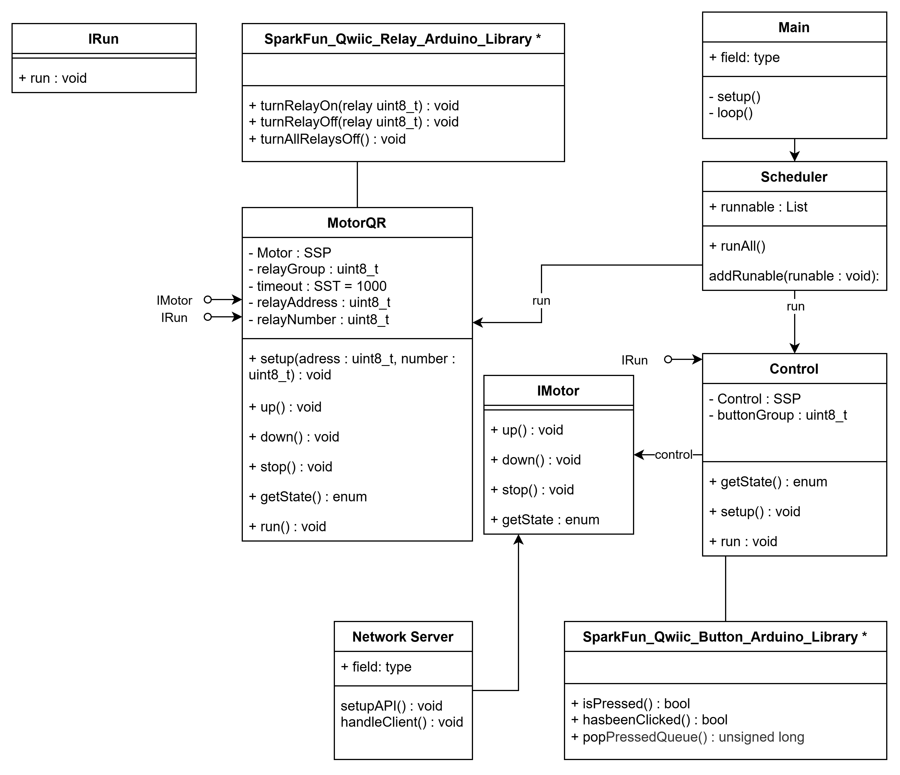
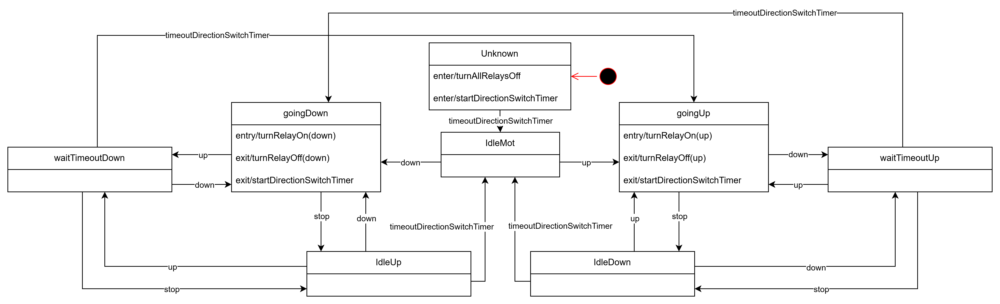
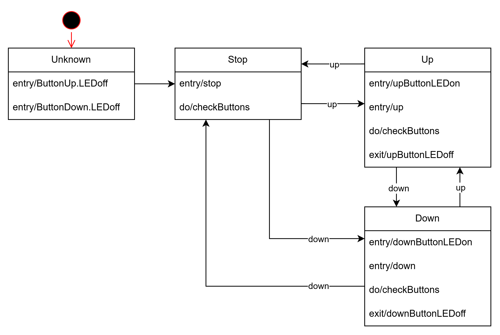
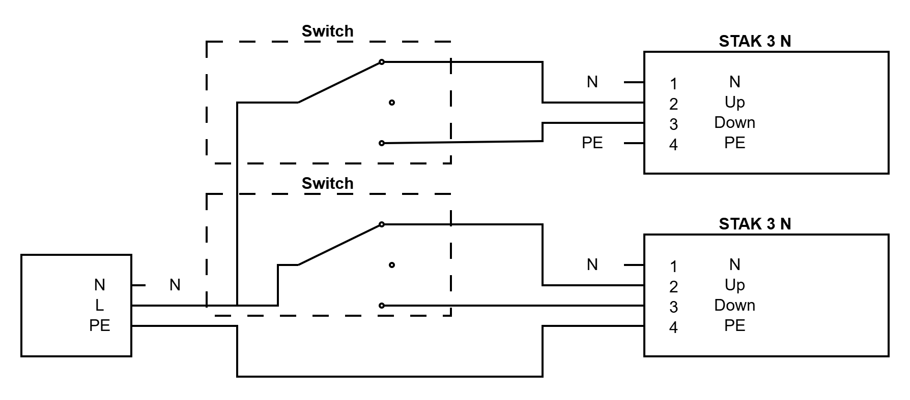
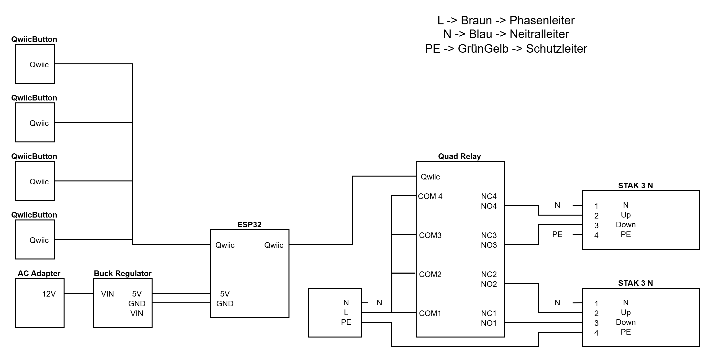
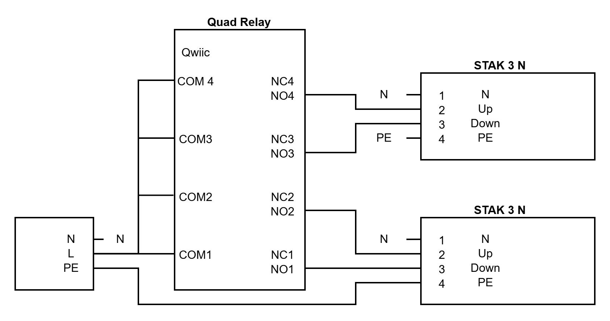

## Übersicht

Das Ziel des Projekts ist die Steuerung der Jalousien zu vereinfachen durch eine Steuerung per Website/App.
Dafür wurde ein ESP32 mit Qwiic-Hardware verwendet.

Dieses Projekt nutzt objektorientiertes C, um eine leichte Erweiterbarkeit zu gewährleisten.
Der Code nutzt I2C um mit den verschiedenen Hardware-Komponenten zu kommunizieren.
Das Projekt wird mit Steckverbindungen eingebaut für einen schnellen Wechsel zwischen den Drehschaltern und diesem Projekt.

## Libraries / Klassen

### UML

### Main

Ruft alle Initialisierungen auf und führt dann im Loop den Scheduler und die API aus.

Setup:

- Motoren erstellen
- Control erstellen
- WLAN verbinden
- API initialisieren/starten

Loop:

- Scheduler ausführen
- API-Clients verarbeiten

### Scheduler

Ruft alle Run-Funktionen auf, diese werden mit dem IRun Interface implementiert.
Es wird nur eine Liste dieser Funktionen erstellt und anschliessend ausgeführt, es hat keine spezielle Logik dahinter.

runAll:

- führt alle Funktionen der Runnable-Liste aus

listRunnable:

- nicht implementiert, würde alle ausführbaren Funktionen auflisten.

addRunable:

- fügt ausführbare funktion (IRun) am Ende der Liste ein.

addRunnableStart

- fügt ausführbare funktion (IRun) am Anfang der Liste ein.

### IRun

Ein Interface für die Scheduler-Funktionen für bessere Skalierbarkeit.

### IMotor

Das Interface, das verschiedene Motoren erlaubt um die Skalierbarkeit zu vereinfachen.

sIMotor: 

- direction Function Pointer
- getState Function Pointer
- getStateName Function Pointer
- command enum
- Void Pointer context

### MotorQR

Implementiert das IMotor Interface um die Relays mit der Motor Logik zu steuern.

#### Zustandsdiagramm

### Control

Liest die Buttons mit der Qwiic Button Library ab. Das Zustandsdiagramm 

#### Zustandsdiagramm

### SparkFun_Qwiic_Button_Arduino_Library

Standard Library für das auslesen der Buttons.

In diesem Projekt werden die folgenden Funktionen verwendet:
- isPressedQueueEmpty
- popPressedQueue
- LEDon
- LEDoff

### SparkFun_Qwiic_Relay_Arduino_Library

Standard Library für das Steuern der Relays.

### SimpleStateProcessor

Eine Klasse die von holisticsolutions (Niederer Engineering GmbH) bereitgestellt wird, um die Erstellung von Zustandsdiagrammen in C++ zu vereinfachen. 

Repository:

<https://github.com/holisticsolutions/SimpleStateProcessor>

### SimpleSoftTimer

Eine Klasse die von holisticsolutions (Niederer Engineering GmbH) bereitgestellt wird, um die Erstellung von Timern in C++ zu vereinfachen. 
Die Timer sind so ausgelegt das man zwischen start und ende code laufen kann, im gegensatz zu sleep der alles blockiert.

<https://github.com/holisticsolutions/Arduino.SimpleSoftTimer>

### NetworkServer

Stellt die Funktionen zum Verbinden mit WLAN, dem Handling und dem Erstellen der API. Diese Funktionen werden im Main ausgeführt.

#### WLAN

Das WLAN wird mit der WiFi.h library aufgesetzt. Es braucht ein secrets.h file um die Verbindung herzustellen. 

#### API

Die API kann die Befehle up, down und stop entgegennehmen, mit der id der Jalousie die man ansteuern will.

/motor?id=1&cmd=up

Parameter:
- id (int): ID der Jalousie (Standard: 1 + 2)
- cmd (string): up, down, stop

Response:
- 400 Invalid command
- 404 Motor not found
- 200 OK

## Schemas

### Schema der Drehschalter 

### Schema aller Komponenten

### Schema der Relays
