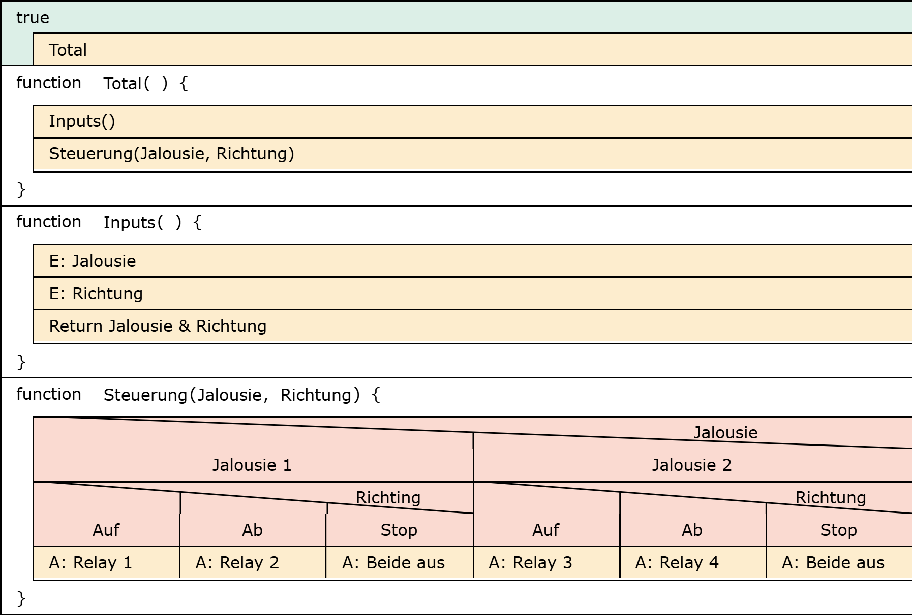
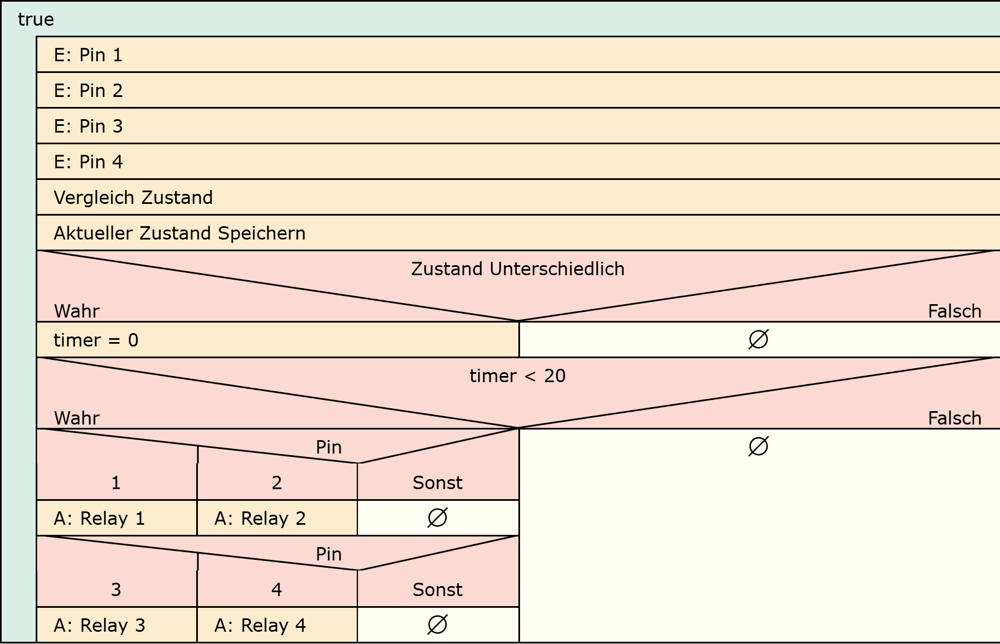

# Infos

## Komponenten

### ESP32

#### Specs

* Dual-core Tensilica LX6 microprocessor
* Up to 240MHz clock frequency
* 520kB internal SRAM
* 128mbit/16MB flash storage
* Integrated 802.11 BGN WiFi transceiver
* 2.7 to 3.6V operating range
* 10-electrode capacitive touch support
* Hardware accelerated encryption (AES, SHA2, ECC, RSA-4096)

#### Possible Connectors

* 1x USB dedicated for programming and debug
* 1x UART
* 2x I2C
* 1x SPI
* 7x GPIO
* 2x Digital Pins
* 2x Analog Pins
* 2x PWM
* Status LED
* VIN Level ADC

### Qwiic Quad Relay

#### Specs

* Four JZC-11F Relays
* 5A at 250VAC, 30VDC
* Each relay has its own colored LED and silk labels for easy identification.
* Ground pour isolated from relays.
* Air gap around common pin on the relays.
* Large trace width on relay pins far exceeding the peak 5A current.
* I2C commands for toggling individual relays or all the relays at once.
* I2C commands for turning all relays off or on.
* Two I2C addresses
* 0x6D (Default)
* 0x6C
* I2C address is software configurable.
* 26-14 Gauge AWG wire
* Max Current Draw ~250mA
* Vin via Barrel Jack 2.1mm, 5.5mm
* 7V to 12V
* Vin via Barrel Jack Bypass Jumper Closed
* 5V

#### 

### ATP Carrier Board

#### Specs & Connections

* M.2 Connector
* Operating Voltage Range
* ~3.3V to 6.0V (via VIN to AP7361C 3.3V Voltage Regulator)
* 3.3V (via 3V3)
* 1mAh battery backup for RTC
* Reset
* Boot
* LEDs

#### Possible Connectors

* 1x USB type C
* 1x USB type A Host
* 2x Qwiic Enabled I2C
* 1x CAN
* 1x I2S
* 2x SPI
* 2x UARTs
* 2x Dedicated Analog Pins
* 2x Dedicated PWM Pins
* 2x Dedicated Digital Pins
* 12x General Purpose Input Output Pins
* 1x SWD 2x5 header

### Total Connectors

* 2x I2C
* 1x SPI
* 7x GPIO
* 2x PWM
* 2x Analog
* 2x Digital
* 1x UART
* USB A
* USB C

## Programing

### PlatformIO

#### Language

* C
* C++

#### 

### Program

### Structure diagram

#### Extern

{width=800}

#### Erklärung

In der Funktion Inputs werden die Eingaben ausgelesen und ausggeben. Zusätzlich werden in der Funktion Steuerung werden diese Ausgewertet und an die verschiedenen Relais gesendet. 

#### Switches

{width=800}

#### Erklärung

Die Schalter werden ausgelesen und direkt an die Relais weitergeleitet.

#### Switches Verbessert

{width=800}

#### Erklärung

Die Schalter solten nicht immer ausgeführ werden auch wenn der Laden schon ganz unten ist.

### Voreinstellungen

Bei Voreinstellungen muss darauf geachtet werden das der aktuelle Stand per Drehschalter verändert werden kann. Man könnte entweder bei jeder Voreinstellung das System nullen oder den aktuellen Stand auf den ESP speichern und abrufen.

### Komponenten

#### SparkFun Qwiic Quad Relay

Enthält Qwiic anschlüsse welche leicht verwendbar sind. Hat die richtige anzahl Relais, da es pro Jalousie 2 braucht.

#### SparkFun Qwiic Button

Enthält Qwiic anschlüsse welche leicht verwendbar sind. 