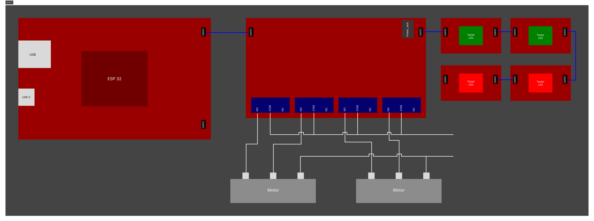

# Komponenten

| SKU                     | Bezeichnung                                      | Stück/Preis |  Total       |
|:-----------------------:|:------------------------------------------------:|:-----------:|:------------:|
| **BOB-15932**           | SparkFun Qwiic Button - Red LED                  | 2x Fr.4.36  | Fr.8.72      |
| **BOB-16842**           | SparkFun Qwiic Button - Green LED                | 2x Fr.4.22  | Fr.8.44      |
| **WRL-16781**           | SparkFun MicroMod ESP32 Processor                | 1x Fr.15.40 | Fr.15.40     |
| **DEV-17723**           | (SparkFun MicroMod Qwiic Carrier Board - Single) | 1x Fr.8.76  | Fr.8.76      |
| **COM-16566**           | SparkFun Qwiic Quad Relay                        | 1x Fr.28.60 | Fr.28.60     | 
| **WR9MA2000CCP-F(R6B)** | WR9MA2000CCP-F(R6B)                              | 1x 6,53     | CHF 6,53     |
| **Total**               |                                                  |             | **Fr.69.96** |

Genaue Schemen können [hier](https://www.altium365.com/viewer/de/) angezeigt werden.
Die .brd dateien können auf dem jeweiligen Github gefunden werden.

[Taster Masse](https://www.pcb-3d.com/wordpress/models/sw_zhejiang_omten_electronics_tsd1265/)

## Effektive Bestellliste

| SKU                     | Bezeichnung                                      | Stück/Preis |  Total       |
|:-----------------------:|:------------------------------------------------:|:-----------:|:------------:|
| **BOB-15932**           | SparkFun Qwiic Button - Red LED                  | 2x Fr.4.36  | Fr.8.72      |
| **BOB-16842**           | SparkFun Qwiic Button - Green LED                | 2x Fr.4.22  | Fr.8.44      |
| **PRT-14427**           | Qwiic Cable - 100mm                              | 4x Fr.1.37  | Fr.5.48      |
| **PRT-14426**           | Qwiic Cable - 50mm                               | 1x Fr.0.84  | Fr.0.84      |
| **WR9MA2000CCP-F(R6B)** | WR9MA2000CCP-F(R6B)                              | 1x 6,53     | CHF 6,53     |
| **Total**               |                                                  |             | **Fr.30.01** |
