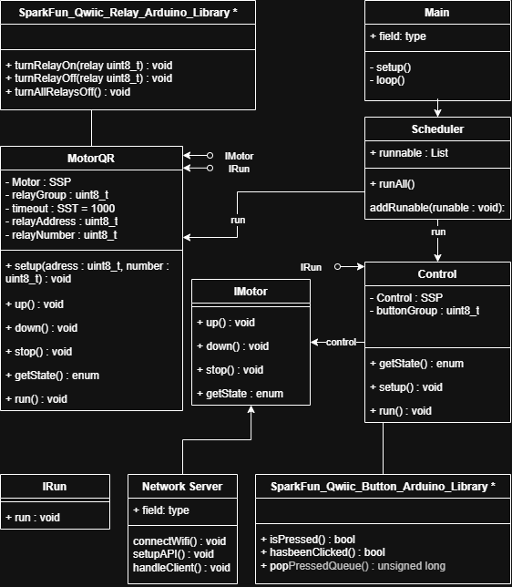
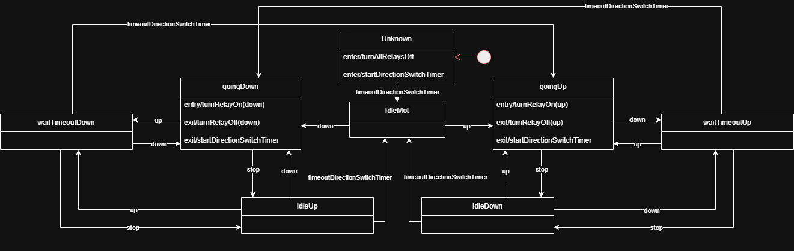
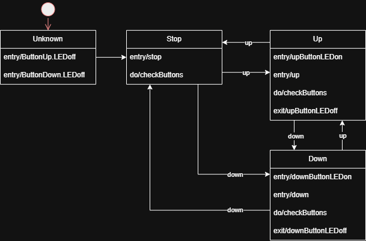

# Technische Dokumentation

## Konzeption

### Idee

Die Idee dieses Projektes ist die Steuerung der Jalousien zu vereinfachen. Das wurde vor Beginn des Projektes mit Schaltern getan. Am Ende ist die Steuerung per API und Buttons möglich.

### Systemarchitektur

Das System basiert auf Qwiic(I2C) Komponenten. Folgende wurden verwendet:
- ESP32 MicroMod
- MicroMod ATP Carrier Board
- Qwiic Quad Relay (Discontinued)
- Qwiic Button
- Buck Converter
- 12V Netzteil


#### Technologien

C, C++, OOP mit C, PlatformIO


### Datenmodelle

#### UML



Die Motoren sind mit dem Strategy Pattern Implementiert und sind auswechselbar.

#### Zustandsdiagramme

Dieses Diagramm zeigt die Funktion und die Sicherstellung des Betriebs des Motors.


Dieses Diagramm zeigt die Logik die die zwei Inputs der Buttons in drei Outputs für den Motor umwandeln. 


### Frontend

Das aktuelle Frontend ist nur eine sehr einfache Webseite die über Fetch mit der REST API des ESP kommunizieren kann. Es gibt aktuell immer noch den Fehler, dass die CORS security policy nicht eingehalten wird, das ist aber kein Client sondern Server Problem.

### Mögliche Verbesserungen

- Frontend
- Class for Single Relay
- Zusätzlicher Support für 3 Relay Outputs (Up Down1 Down2)
- Einfachere Hostname Konfiguration
- Dieser Fehler kann durch das Hinzufügen der policy im Network Controller getan werden, die API funktioniert jedoch trotzdem, da ein erster "test" Request ankommt. Errormessage: blocked by CORS policy: No 'Access-Control-Allow-Origin' header is present on the requested resource.
- Rate Limiting
- "Halb Statische" dinge in EEPROM verschieben (Hostname, evtl. 2. API-Key (1 für config + 1 für credentials -> credentials in code anderer in EEPROM), etc.)
- Sicherheit für Public Netzwerke (IP Whitelist oä.)

#### Ideen für Zusatzfunktionen

- Zeitgesteuert
- Wärmegesteuert 
- Lichtstärke

### Getting Started für Entwickler

Die Umgebung ist PlatformIO mit diesen Zusatz Konfigurationen im platformio.ini, diese sollten aber beim Pull des Projektes dabei sein.

```ini
framework = arduino
lib_deps = holisticsolutions/SimpleStateProcessor
           holisticsolutions/SimpleSoftTimer
           bblanchon/ArduinoJson @ ^6.21.3
monitor_speed = 115200
build_flags = -Iinclude
```

Falls der Hostname geändert werden muss, kann dies aktuell nur direkt im Code getan werden.
Dies befindet sich im Network.cpp

```cpp
WiFi.setHostname("ESPMicroMod-001");
Serial.println(WiFi.getHostname());
```

Die [PlatformIO](vscode:extension/platformio.platformio-ide) Extension muss installiert sein um die Projekte richtig installieren zu können.

### Abhängigkeiten

**SimpleSoftTimer:** Diese Bibliothek von [holisticsolutions](https://www.niederer-engineering.ch/) fügt einen leichten und effizienten Timer hinzu der genutzt wird um die Timings zwischen den Relais zu gewährleisten.

**SimpleStateProcessor:** Diese Bibliothek von [holisticsolutions](https://www.niederer-engineering.ch/) wird verwendet für eine leichte Implementierung der Zustände nach dem [Zustandsdiagramm](#zustandsdiagramme)

**Qwiic Button** Diese Bibliothek ermöglicht ein leichtes auslesen der Buttons. Sie wird verwendet, da sie für die von mir gewählten Buttons entwickelt wurde.

**Qwiic Relay** Diese Bibliothek wird verwendet um das Quad Relay anzusteuern. Diese sind aber nicht mehr in Produktion. Die Bibliothek ist auch mit den einzelnen Relays

### Deployment

Das Projekt kann mit dem PlatformIO Upload an auf den mit USB angeschlossenen Mikrocontroller (In meinem Fall ESP32) geladen werden.