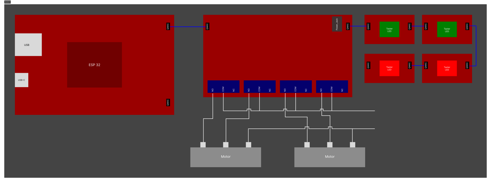
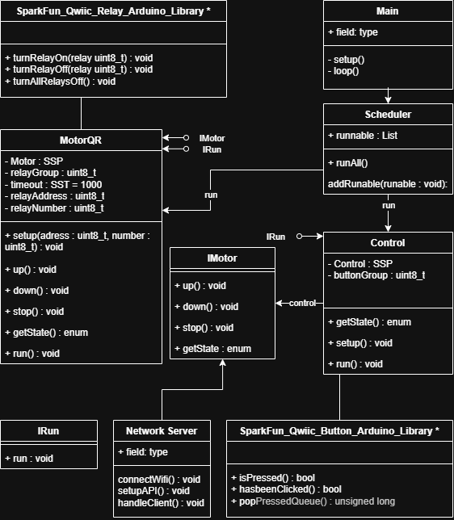
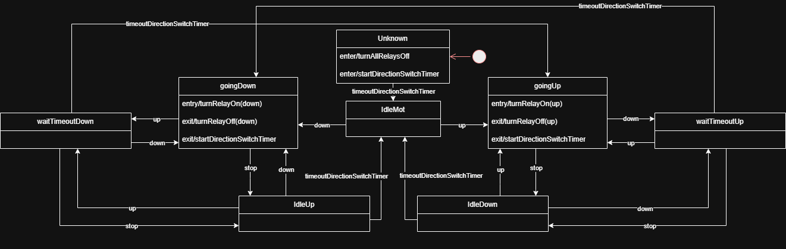
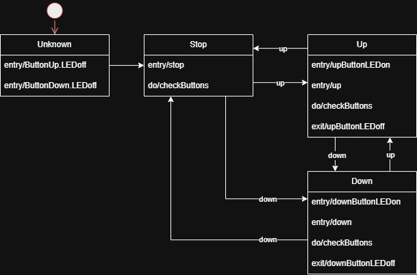

# Technical Documentation

## Conception

### Idea

The Idea behind this project is the possibility to ease the controlling of shutters. This should be achieved by making it possible to control the shutters through an api and still have the possibility to control it physically. 

### System architecture

The System is based on Qwiic(I2C) components. These were used:
- ESP32 MicroMod
- MicroMod ATP Carrier Board
- Qwiic Quad Relay (Discontinued)
- Qwiic Button
- Buck Converter
- 12V Power supply



#### Technologies

C, C++, OOP mit C, PlatformIO

### Data models

#### UML



The motors use the strategy pattern and are therefore replaceable my any class implementing IMotor.

#### State diagrams

This diagram shows the function and how the motor ensures the operation.


This diagram shows the logic used to create three output out of the two inputs for controlling the motor.


### Frontend

The current frontend is an basic website which uses fetch on the REST API provided by the ESP32. Currently there is a small problem on the server-side so that there is an error. Built it still works.

### Possible Improvements/Features

See [Issues](https://github.com/gbssg/ims.project.shuttercontrol/issues)

### Getting started for developers

The environment used is PlatformIO in Visual Studio Code. There is an configuration file that is configured to my hardware. When using different hardware the platformio.ini should be changed accordingly.

If the Hostname has to be changed this can be done in the code. The corresponding code is located in the NetworkServer.cpp.

```cpp
WiFi.setHostname("ESPMicroMod-001");
Serial.println(WiFi.getHostname());
```

The [PlatformIO](vscode:extension/platformio.platformio-ide) extension has to be installed in VSCode to use and install this Project properly.

### Dependencies

**SimpleSoftTimer:** This library from [holisticsolutions](https://github.com/holisticsolutions) adds an lightweight an efficient timer that allows exact timings while switching or other timing related functions. 

**SimpleStateProcessor:** This Library from [holisticsolutions](https://github.com/holisticsolutions) is used to create state machines more easily according to the [State diagrams](#State diagrams).

**Qwiic Button** This library from [SparkFun Electronics](https://github.com/sparkfun) allows easy access to the buttons.

**Qwiic Relay** This library from [SparkFun Electronics](https://github.com/sparkfun) is used to control the quad relays.

### Deployment

This Project can be uploaded to an with USB connected micro-controller () with PlatformIO. 